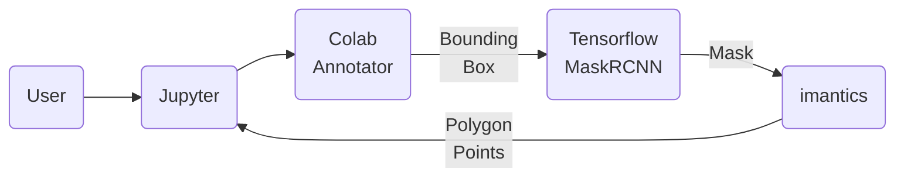
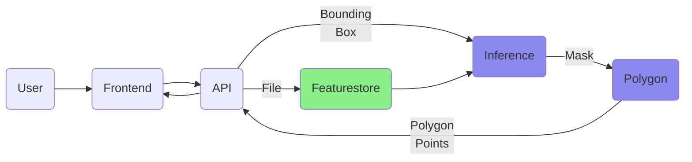
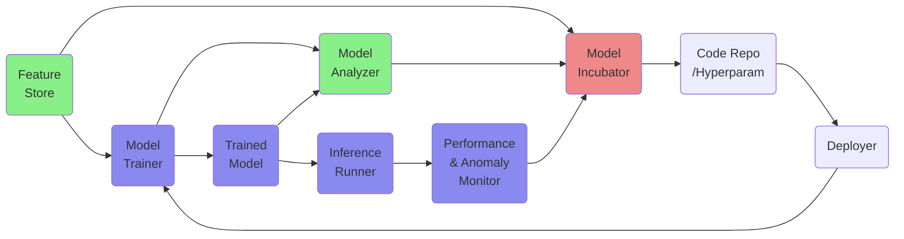

# annotheta

This is the repo for our MLE capstone project at fourthbrain.ai, cohort 6. The domain we have chosen is Image Annotation, specifically Semantic Segmentation. We aim to create value for the human annotators, and to try our best to enable an increase in both speed and accuracy of the annotations.

Our vision: Every annotator is happy and having fun at their job. Our mission: To create a working proof-of-concept smart annotation platform that is easy to learn and hard to forget.

## Project Scope

We are limiting the scope to only single-user scenarios, doing mainly segmentation tasks. Multi-user activities are considered and incorporated into the design but not implemented, such as authentication, training, multi-user jobs, and auditing.

The metrics we use for measuring speed improvement are collected per segmented object and also per image. We count the number of clicks, the number of seconds of mouse-button-down while moving, and the number of clicks for extra-annotation tasks (tasks not directly related to the actual annotation tasks, e.g. loading file, saving progress, etc).

We will perform manual inspections instead of implementing accuracy metrics. If time permits, we will try generating synthetic images starting from masks, and automate measurement of accuracy that way. However, the number of polygon points per object will be used against ADE20K and Cityscapes datasets, along with eyeballing, as a measure of balance between speed and accuracy.

## User Process

The user goes roughly through these steps/interactions:

1. Upload a single image file or a zip file containing images --- the system displays the image or thumbnails
2. Click an image thumbnail to work on --- a full size image will be displayed
3. Hover over an object to annotate --- the initial detector will provide a bounding box
4. Click the box --- the initial server-side segmentor will provide a mask with movable polygon points
5. Move the polygon points --- the client-side segmentor will provide a new mask with new points
6. Save annotation

## V1

Version 1 will be implemented in jupyter notebook. "Backend" will be a tensorflow official implementation of Mask RCNN. No extra training, no alternatives, no annotation format, everything will be ad-hoc and manual.

## V2

Version 2 will include a basic frontend, a REST API that talks to the "feature store" (pandas + a single csv file) and the ML backend. Each input file is given a GUID as the id. Frontend will accept a zip file also, which will be given a GUID, plus a sequence number for each image in the zip. Thumbnails will be generated for easy job selection.

## Final Prototype

The dream prototype version will have the following functionalities:

- Working with a single image file or a zip file
- Continuing previously saved work
- Frontend will show updated splines in real time
- 3 modes: Polygon, Spline, Region
  - Polygon: straight lines connecting segmentation points
  - Spline: centripetal Catmull-Rom curves connecting the points
  - Region: easily selectable contour regions
- Feature store is pandas + single csv
- Deployed on kubernetes cluster
- Model Trainer will be continually updated based on Analyzer and Performance Monitor
- Frontend will record speed metrics

