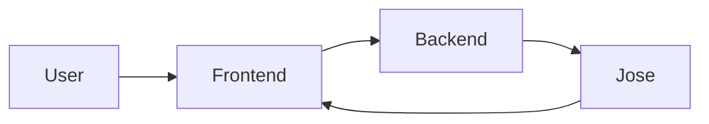
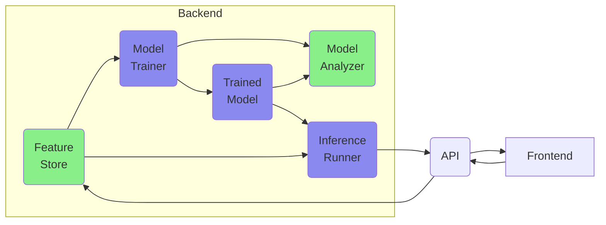
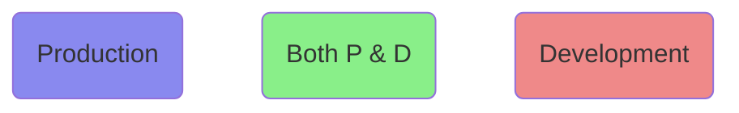
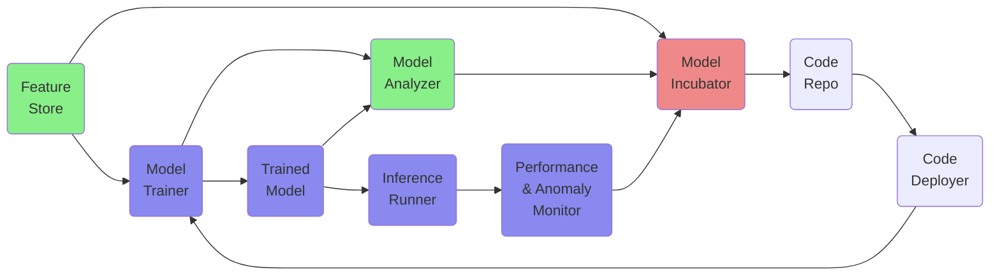
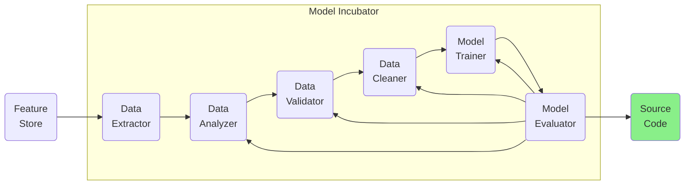
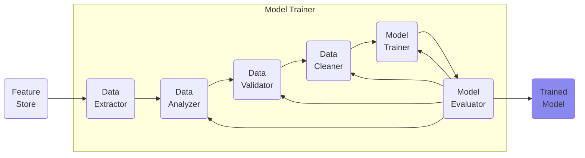

# annotheta

### Small Picture

### The Backend

### Bigger Picture

### The Incubator vs the Trainer

The Incubator and the Trainer are alike. The Incubator produces the "baby." The Trainer produces the "athlete." The difference is in the output. The "baby" source code is passed on to the Trainer who trains the model to "lift weights." The end result of this process is learned weights.

## Background

Background and Significance of Project.

## Related Work

(Papers, github)

## Datasets

ADE20K

Cityscapes

## Processes and Methods

## Outcomes

Possible usage: run against segmentation datasets like ADE20K, Cityscapes, and score. In cases where our model is better, re-evaluate dataset. https://arxiv.org/pdf/2103.14749.pdf

Why not generate scenes together with segementations? Or generate the masks first and then fill up?

50 images: should go to 150 or stay 50? make existing data better, or make it easier to get more data? Then parameter could be: metric wish. e.g. accuracy=60% etc

## System Design and Ethical Considerations

Language:

- vim-like, with 4 modes: Normal, Command, Insert, Visual
- https://yanpritzker.com/learn-to-speak-vim-verbs-nouns-and-modifiers-d7bfed1f6b2d
- https://stackoverflow.com/questions/1218390/what-is-your-most-productive-shortcut-with-vim/1220118#1220118
- https://dev.to/iggredible/mastering-vim-grammar-1dfi
- https://benmccormick.org/2014/07/02/learning-vim-in-2014-vim-as-language

Ethics:

- Mouse and keyboard vs tablet and stylus? cheap labor with cheap equipment?

## Future work and Timeplan

