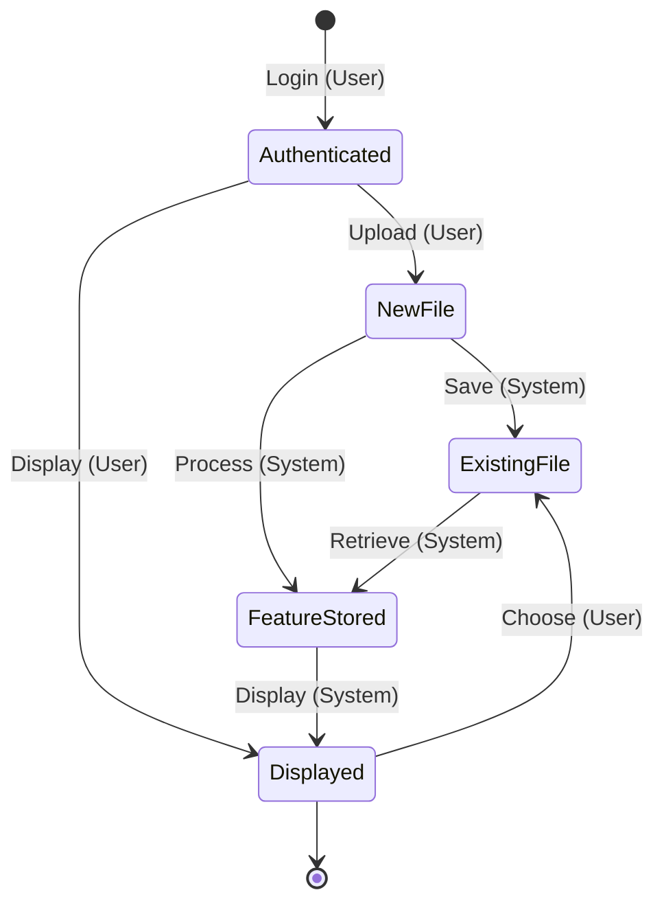
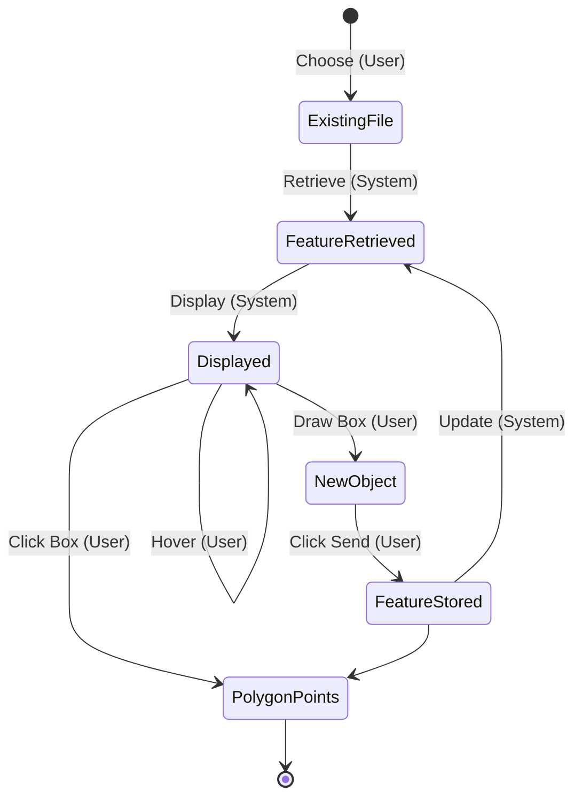
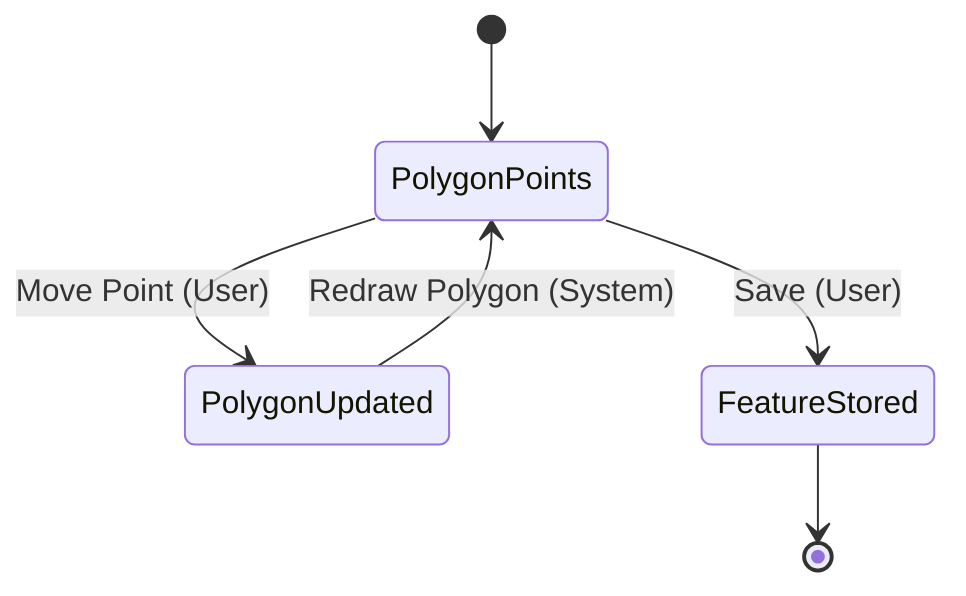
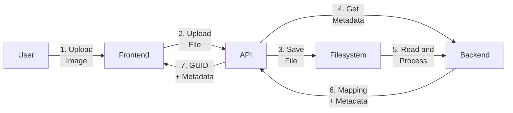
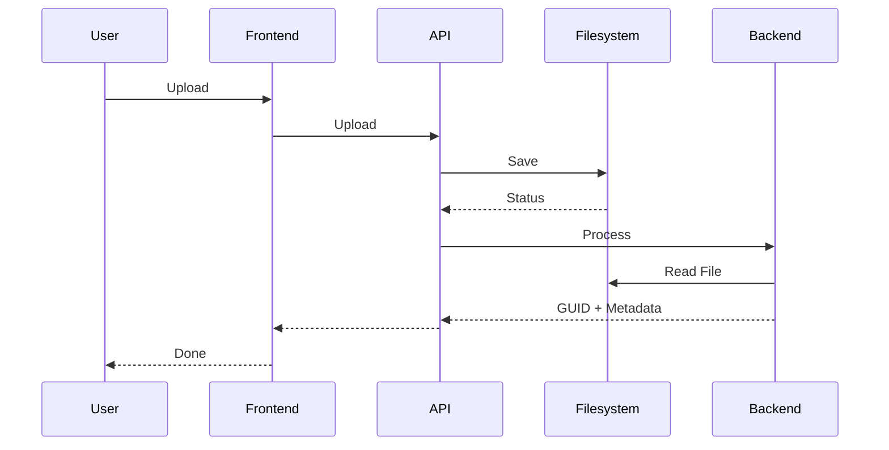
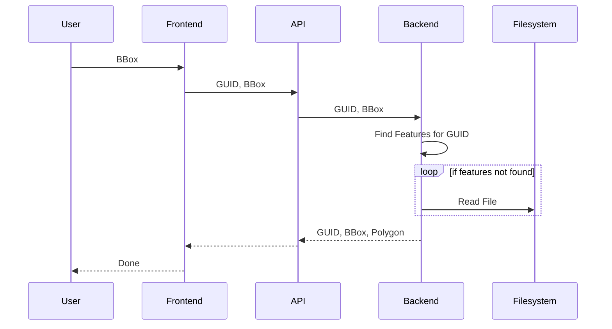

# Workflows

## 1. Upload

Random Notes:

Interaction with user is very important. Introduce features and get easy feedback 3 times (Like or Not). At the 4th time, text box for comments and suggestions.

Feature: histogram of image. Maybe tasks for similar histograms will be similar as well? Night, mostly dark, mostly grass, etc.

## 2. Choose

## 3. Segment

# Older Stuff

## 1. Upload (Old)

## 2. BBox (Old)

